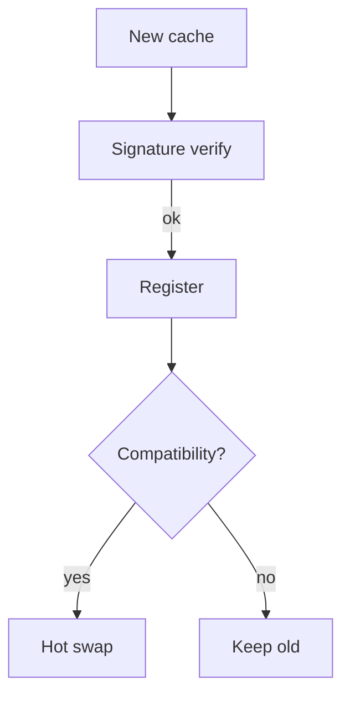

# Agent Link Cache (ALC)

The Agent Link Cache provides a signed, versioned cache of agents, libraries,
and manifests for NitrOS. ALC replaces conventional dynamic linker caches with
an agent-aware design that supports hot upgrading and multi-architecture
composition.

## On-Disk Format

```
+----------------+-----------------------------------------------+
| Field          | Description                                   |
+================+===============================================+
| magic          | `ALC0` little-endian magic                    |
| version        | Cache format version                          |
| arch           | Target architecture (e.g. `x86_64`, `wasm32`) |
| abi            | ABI tag (`N2-1.0`, `N2-1.1`, `NOSM-2`, ...)   |
| entry_count    | Number of cached objects                      |
| index_offset   | Offset to entry index table                   |
| sig_offset     | Offset to cache signature block               |
+----------------+-----------------------------------------------+
```

Each cache entry is described by an `alc_entry` record found in the index table.
Entries reference code blobs, manifests, and export tables stored elsewhere in
the cache file. The cache file is self-contained: every blob is hashed and the
entire cache is signed so that updates can be atomically verified before use.

### Entry Record

```
struct alc_entry {
    uint32_t type;        // module, shared-lib, manifest, wasm, ...
    uint32_t flags;       // hot-reload, prelinked, etc.
    uint64_t blob_offset; // location of code/data blob
    uint64_t blob_size;   // length of blob
    uint64_t manifest_off;// offset to embedded manifest
    uint64_t manifest_sz; // size of manifest
    uint8_t  hash[32];    // SHA-256 of blob+manifest
    uint8_t  sig[64];     // Ed25519 signature over hash
    char     name[64];
    char     version[16];
    char     abi[16];
};
```

The manifest is a machine-readable description of the agent/library including
its exported symbols, dependencies, required capabilities, and supported ABIs.
Multiple architectures or ABI revisions can coexist inside one cache by using
separate ALC files. The agent registry can select the best match for a process
at load time.

## In-Memory Layout

The kernel maps the entire cache read-only and maintains a small writable usage
record per entry:

```
struct alc_usage {
    uint64_t hits;        // number of times mapped
    uint64_t last_used;   // monotonic timestamp
    uint8_t  locked;      // pinned in memory
};

struct alc_cache {
    const struct alc_header *hdr;
    const struct alc_entry  *entries;
    struct alc_usage        *usage; // parallel array sized entry_count
};
```

The usage table lives outside the immutable cache image so that hot updates can
simply replace the mapped file and reuse statistics. Background optimisation and
eviction daemons consult this table to keep frequently used agents resident
while discarding cold entries.

## Agent Registry Integration

Agents and user processes request objects through the registry rather than by
file path:

```
void *ptr = alc_request("NOSFS", "1.2.0", "N2-1.0");
```

The registry scans loaded caches, validates the entry, applies any relocations
or prelink patches, and returns a pointer to the mapped code. If a compatible
upgrade is present the registry transparently migrates handles to the new code
and records a hot-reload event.

## Security and Atomic Updates

* All cache files and entries are signed; the header contains offsets to
  detached signatures so that updates can be verified before activation.
* Cache updates are performed by writing a new file next to the old one and
  atomically renaming it. Processes already using the cache continue to see the
  old mapping until they reload or are hot-patched.
* Every update produces an audit record referencing the manifest and signature.

## Background Optimisation

A low-priority daemon can walk the usage table to:

* Prelink and relocate popular agents for faster startup.
* Recompute and validate signatures.
* Evict unused entries or entire caches once no process references them.
* Defragment caches by rebuilding them from manifests.

## Advantages Over dyld and ld.so

* **Manifest-aware**: caches store structured metadata and dependency
  information, not just file offsets.
* **Hot upgradable**: entries may be replaced while processes are running when
  the ABI is compatible.
* **Multi-language**: supports WebAssembly and Rust modules in addition to
  native code.
* **Per-agent usage stats** enable smart eviction and prefetching.
* **Isolated or shared caches** allow per-user or per-VM policy control.

## Example Manifest

```json
{
  "name": "NOSFS",
  "version": "1.2.0",
  "abi": "N2-1.0",
  "type": "shared-lib",
  "exports": ["nosfs_init", "nosfs_read"],
  "dependencies": [
    {"name": "core", "version": ">=1.0"}
  ],
  "signature": "BASE64-ED25519-SIG"
}
```

## Cache Builder Tool

A simple host-side tool assembles an ALC image from manifests and binary blobs.
See [`tools/alc_build.c`](../tools/alc_build.c) for a reference implementation.

## Hot Reload Workflow

1. New manifest + binary are written to a fresh cache file.
2. Builder signs the cache and moves it into place atomically.
3. Kernel notices new cache via registry update and validates signature.
4. Compatibility is checked; if ABI and version are acceptable, live pointers are
   switched to the new object and usage stats are migrated.
5. Old cache image is retained until no process references it, then removed.



## Query Examples

```
// Kernel side
const struct alc_entry *e = alc_find("VirtNet", "0.9.1", "N2-1.0");
void *virt = alc_map(e);

// User side via syscall
int fd = nosm_open("libcrypto", "2.3.4");
void *lib = mmap(fd, ...); // kernel maps from cache
```

ALC turns the dynamic linking cache into a secure, auditable, and hot-upgradable
registry of agents, enabling faster startup and fine-grained modularity.

